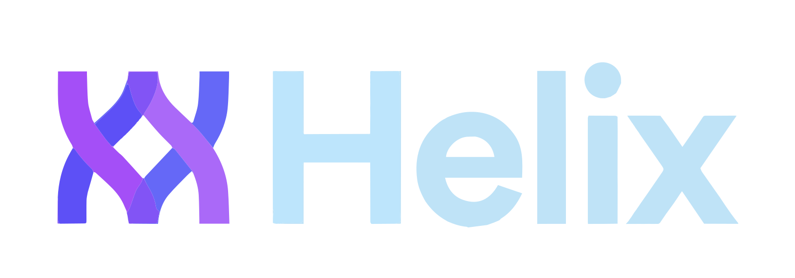
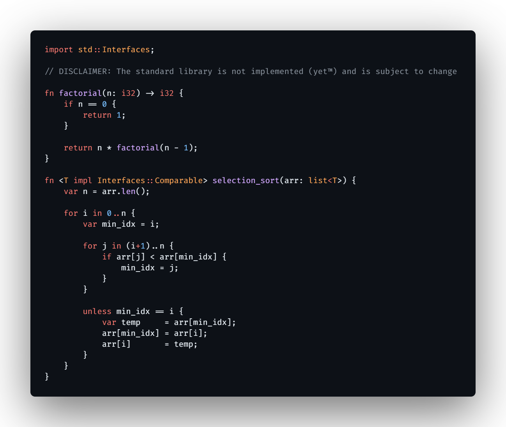
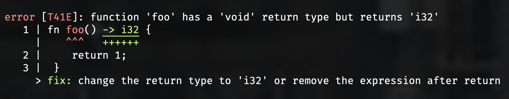
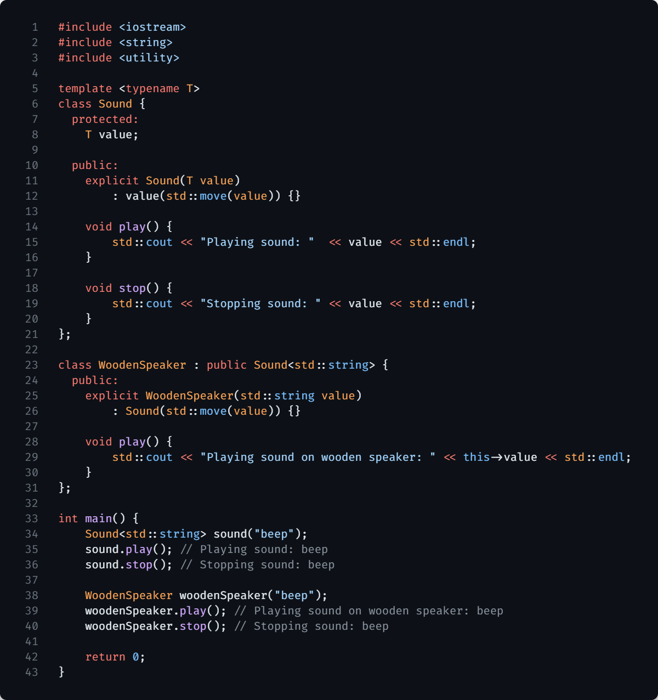
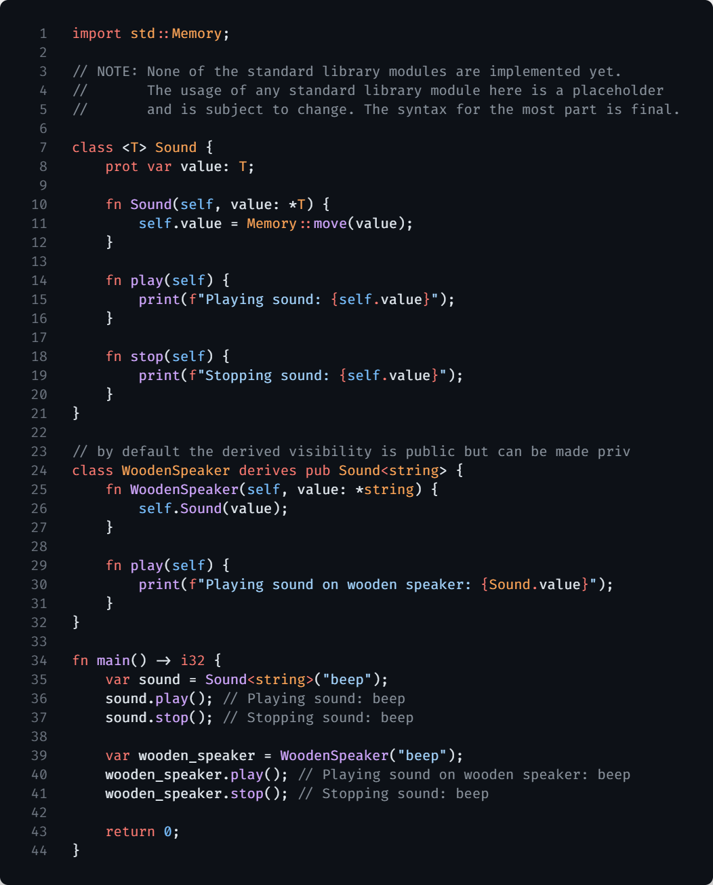
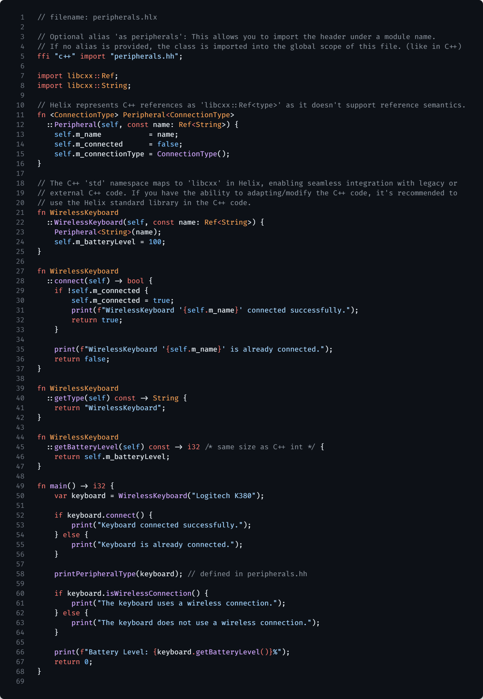
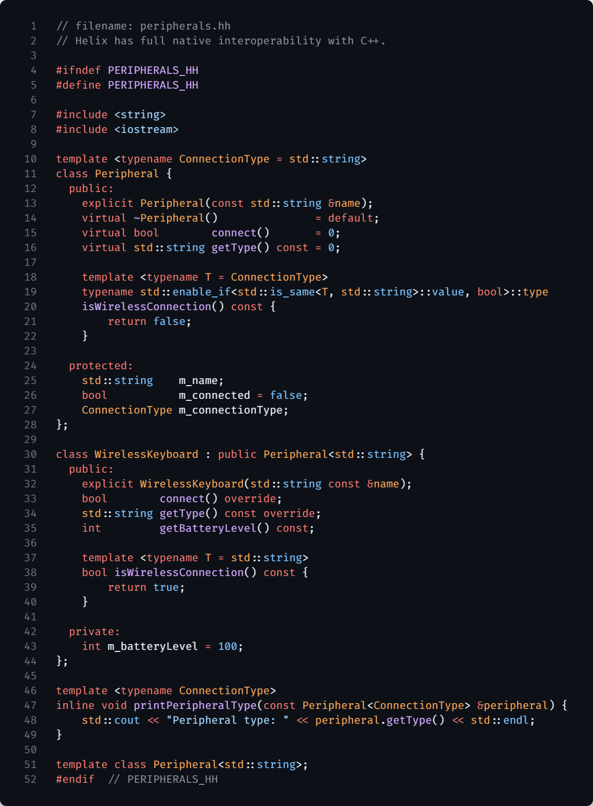
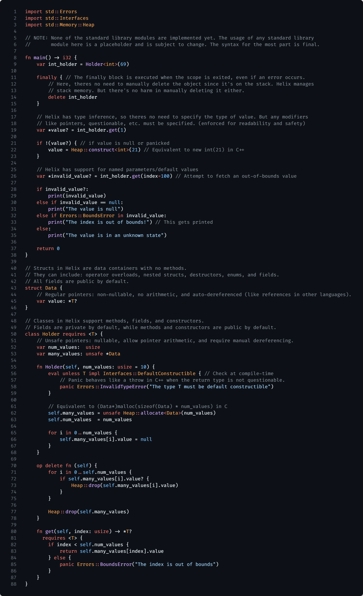
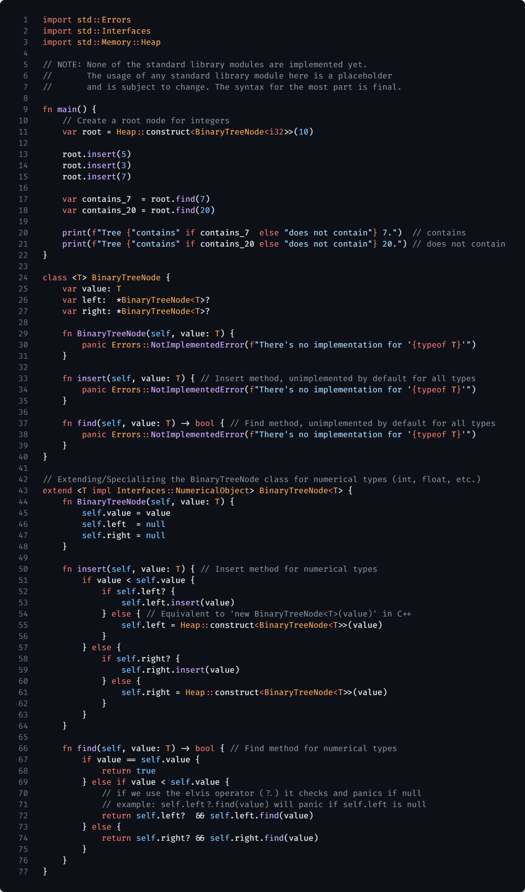
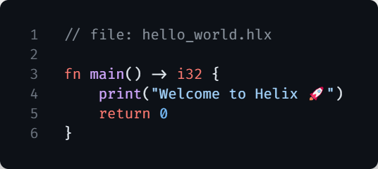

<div align="center">
  
</div>

# Helix: A Readable, High-Performance, Low-Level Language.

<div>
  
</div>

## Key Goals of Helix:

**High-performance**: The language is designed to performance match C; But, with the latest features and a more expressive syntax.

**Safety**: Focused on safe memory management without sacrificing developer productivity and freedom.

**Advanced Memory Tracking**: Implements a [Advanced Memory Tracking](#advanced-memory-tracking-amt) system for memory safety, while being far less strict than other languages, however that depends on user preference and can be made strict.

**Robustness**: Provides tools and features that ensure code stability and reduce runtime exceptions, along with a cross-platform standard library.

<div>
  
</div>

--------------------------------------------------------------------------------

> [!NOTE]
> ## We've now started work on the **self-hosted compiler**, using the current C++-based implementation as a bootstrap. You can follow and contribute to this effort by checking out the [`self-hosted`](https://github.com/helixlang/helix-lang/tree/self-hosted) branch.

> [!NOTE]
> ### Documentation Status & AI Assistance
> This documentation is actively being developed; right now is is quite outdated.
> > ### AI Content Disclaimer
> > Initial drafts of the Docs, were created by us, then fed to ChatGPT to refine for accuracy and clarity, it may be incorrect in terms of wording, but we are rewriting it at this moment. Commit messages are generated using the GitLens Commit Message Generator. All code, designs, and core concepts are the work of us.


--------------------------------------------------------------------------------

## Table of Contents

- [Helix: A Readable, High-Performance, Low-Level Language.](#helix-a-readable-high-performance-low-level-language)
  - [Key Goals of Helix:](#key-goals-of-helix)
  - [Table of Contents](#table-of-contents)
    - [Design Philosophy:](#design-philosophy)
  - [Error Reporting \& Handling](#error-reporting--handling)
    - [Error Reporting](#error-reporting)
    - [Error Handling](#error-handling)
  - [Familiarity to C++](#familiarity-to-c)
    - [Language Features](#language-features)
    - [C++ Interoperability](#c-interoperability)
  - [Features of Rust, Zig, Odin, Nim, and Helix](#features-of-rust-zig-odin-nim-and-helix)
    - [Object-Oriented Programming (OOP)](#object-oriented-programming-oop)
    - [Memory Safety](#memory-safety)
    - [Language Features](#language-features-1)
    - [Syntax and Ergonomics (User Preference)](#syntax-and-ergonomics-user-preference)
    - [Example Code Illustration](#example-code-illustration)
  - [Extending Functionality with Generics and Inheritance](#extending-functionality-with-generics-and-inheritance)
    - [Extending `BinaryTreeNode` for Numerical Types](#extending-binarytreenode-for-numerical-types)
  - [Helix ABI and FFI System](#helix-abi-and-ffi-system)
    - [Helix FFI System](#helix-ffi-system)
      - [Core Features](#core-features)
      - [The Helix ABI Extension file defines how Helix interacts with foreign languages, including:](#the-helix-abi-extension-file-defines-how-helix-interacts-with-foreign-languages-including)
      - [Benefits for Multi-Language Projects](#benefits-for-multi-language-projects)
    - [Advanced Memory Tracking (AMT)](#advanced-memory-tracking-amt)
      - [Key Features](#key-features)
    - [Vial: Cross-Language Module Format](#vial-cross-language-module-format)
      - [Key Features](#key-features-1)
  - [What constitutes as Pure Helix Code?](#what-constitutes-as-pure-helix-code)
    - [Helix's Cache System](#helixs-cache-system)
  - [Helix Roadmap](#helix-roadmap)
    - [Quick Start](#quick-start)
      - [Installation \& Build](#installation--build)
    - [Prerequisites](#prerequisites)
      - [Windows Specific (Visual Studio Build Tools)](#windows-specific-visual-studio-build-tools)
      - [MacOS, Unix or Linux Specific (clang or gcc)](#macos-unix-or-linux-specific-clang-or-gcc)
      - [All Platforms (After following platform specific steps)](#all-platforms-after-following-platform-specific-steps)
    - [Hello, World!](#hello-world)
  - [License](#license)
  - [Acknowledgements](#acknowledgements)
  - [Links](#links)

--------------------------------------------------------------------------------

### Design Philosophy:

**Simple syntax**: Combines the some of the most readable languages, with C++'s power and Python's intrinsics - at compile time - to create a language that is both extremely powerful and easy to use even for newcomers. **General-purpose**: Suitable for a wide range of applications, from systems programming to high-performance computing, game development, and more. Due to its performance and low-level capabilities, Helix is ideal for both system-level programming and regular application development. **Ease of use**: Designed to be beginner-friendly while still offering very low-level features for experienced developers. **Interoperability**: Seamless complete integration starting with C and C++, then expanding to other languages. With an extendable FFI system that allows for easy bi-directional interoperability with any other language.

--------------------------------------------------------------------------------

## Error Reporting & Handling

Helix's error reporting and handling system prioritizes clear diagnostics and flexible error management for developer productivity and code reliability.

### Error Reporting

Helix produces precise error messages with:

- **Error Codes**: Referenceable in the [Helix Error Codes Reference](https://helix-lang.com/docs/errors) [WIP].
- **Contextual Output**: The compiler annotates code snippets to highlight issues.

<div>
  
</div>

This shows a return type mismatch error (`T41E`) with the offending line, expected vs. actual types, and a documentation reference.

### Error Handling

Helix uses a hybrid error-handling model with **questionable types** (`T?`), which can hold a value (`T`), `null`, or a `panic`. This supports both compile-time and runtime error handling.

Key features:

- **Panic Types**: Functions that may fail return `T?` or `panic T` the decision as to weather we should allow a questionable to hold a panic or not is still undecided, but the current draft is that it should not be allowed to hold a panic, but the bootstrap compiler allows it to hold a panic, this is subject to change.
- **Compile-Time Checks**: The compiler requires `T?` returns to be checked via pattern matching or `try`/`catch`.
- **Type Safety**: The compiler enforces safe access to `T?` values, preventing unhandled panics or null dereferences.

The `T?` syntax is a draft and may evolve to `panic T` based on feedback.

--------------------------------------------------------------------------------

## Familiarity to C++

Helix's syntax and semantics are inspired by C++ to ease adoption, with distinct features for clarity and safety. It also integrates directly with C++ codebases.

### Language Features

- **Templates**: Both Helix and C++ use template mechanisms to enable generic programming. Helix has the same core principles and introduces a different syntax `fn <T> name(param: T)` that is more intuitive, while still allowing for powerful type abstractions, along with a greater support for type bounds (i.e. `fn <T impl Comparable, N> name(param: [T; N]) if N > 21`).
- **Operator Overloading**: Define operators like `+` with `fn op <operator> (params)`.
- **Functions and Methods**: Functions and class instance methods use `fn method(self, param: i32)`. Structs are data-only but support operator overloading.
- **Memory Management**: Smart pointers enforce safety. Raw unchecked pointers require `unsafe *T`. You can also disable any implicit behavior with file level attributes like `#[compiler::config("amt", false)]` to disable the Advanced Memory Tracking system, or `#[compiler::config("unsafe", true)]` to disable all safety checks.
- **Classes and Inheritance**: Classes support single inheritance and explicit `virtual` functions, e.g., `class Derived : Base { ... }`.
- **Interfaces**: Interfaces in Helix are similar to C++'s pure virtual classes, providing a way to define abstract types and enforce contracts. While not having the same level of complexity as C++ or the runtime performance overhead, since they are Zero Cost Abstractions, Helix's `interface` keyword provides a simple way to define interface types, while being able to check if any object (even if they don't directly implement the interface) for compliance.
- **Object-Oriented Features**: Like C++, Helix supports classes with member functions, encapsulation, and inheritance. The Helix class structure is streamlined to provide clear and concise object-oriented capabilities without the often verbose syntax found in C++.

<div>
  
  
  
</div>

### C++ Interoperability

Helix integrates with C++ via its Foreign Function Interface (FFI), enabling direct use of C++ libraries and types.

- **Header Inclusion**: Import C++ headers or C++20 modules.
- **Type Mapping**: C++ types (e.g., `std::vector<int>`) are mapped to Helix types, with compiler-generated bindings for memory and function calls.
- **Function Calls**: Call C++ functions directly, with FFI handling calling conventions and type conversions.
- **Declaration Style**: Use C++ classes in Helix without redefinition, as shown below:

<div>
  
  
  
</div>

- **Bidirectional Calls**: Helix functions can be called from C++ with full interoperability, using the Itanium C++ ABI and the C ABI for seamless integration.

See the [Helix C++ Interoperability Guide](https://helix-lang.com/docs/cpp-interop) [WIP] for details.

--------------------------------------------------------------------------------

## Features of Rust, Zig, Odin, Nim, and Helix

This section outlines the technical features of Rust, Zig, Odin, Nim, and Helix in key areas: object-oriented programming, memory safety, language features, and syntax. Each language's approach is described factually to highlight their design choices.

### Object-Oriented Programming (OOP)

- **Odin**: Supports structs with associated procedures for behavior, using explicit procedure calls for polymorphism. Does not include classes or inheritance.
- **Nim**: Provides classes with single inheritance via `object` types and `method` for dynamic dispatch. Supports encapsulation and polymorphism.
- **Rust**: Uses traits for polymorphism with methods like `fn method(&self)`. Structs hold data, with no support for classes or inheritance.
- **Zig**: Offers structs for data organization, with functions defined separately. Does not support classes, inheritance, or traditional OOP polymorphism.
- **Helix**: Same as C++ with classes, inheritance, and polymorphism. Supports operator overloading and method definitions within classes. Classes can implement interfaces for polymorphic behavior, also supports zero-cost interfaces.

### Memory Safety

- **Odin**: Uses manual memory management with allocators (e.g., `context.allocator`). Provides no automatic safety mechanisms.
- **Nim**: Employs garbage collection by default for memory management. Supports manual management with `ptr` types and `dealloc`.
- **Rust**: Enforces memory safety with a borrow checker, using lifetime annotations (e.g., `&'a T`) for references. Uses `Box<T>` for owned data and `Rc<T>` for reference counting.
- **Zig**: Relies on manual memory management with `alloc` and `free` functions. Offers optional allocators for custom memory handling.
- **Helix**: Uses an Advanced Memory Tracking (AMT) system that automatically manages memory safety and with performance at compile time. It supports both automatic and manual memory management, with smart pointers for safety and raw pointers for performance.

### Language Features

- **Odin**: Supports compile-time execution with `when` statements and constant expressions. Includes generics via type parameters, with no macro system.
- **Nim**: Provides macros and templates for metaprogramming with `template` and `macro` constructs. Supports generics with `proc[T]`.
- **Rust**: Offers procedural and declarative macros (e.g., `macro_rules!`) for compile-time code generation. Supports generics with `struct<T>` and `fn<T>`.
- **Zig**: Uses comptime code execution for metaprogramming, with generics via comptime parameters. Does not include a macro system.
- **Helix**: Provides a macro system with `macro name!(params) { ... };` for compile-time code generation. We also support procedural macros for advanced meta-programming with: `macro @name(params) { ... };`.

### Syntax and Ergonomics (User Preference)

- **Odin**: Uses a C-like syntax with `proc name(param: type) -> type` for procedures. Prioritizes simplicity in type and function declarations.
- **Nim**: Features an indentation-based, Python-like syntax. Procedures are defined with `proc name(param: type): type`.
- **Rust**: Uses a syntax with explicit ownership annotations (e.g., `Box<T>`, `Rc<T>`). Functions are defined as `fn name(&self, param: T) -> T`.
- **Zig**: Adopts a C-like syntax with minimal abstractions. Functions are defined as `fn name(param: type) type`.
- **Helix**: Uses a syntax with `fn <T> name(params: T)` for generics and `class X { fn method(self); fn static_m() static; }` for methods. Structs are defined as `struct X { var field: type }` (there are more in-depth cases, but this is the high-level overview).

For more details, see the [Helix Language Guide](https://helix-lang.com/docs) [WIP].

--------------------------------------------------------------------------------

### Example Code Illustration

Here's a glimpse of Helix's type system in action, demonstrating how these features are applied in real code scenarios:

<div>
  
</div>

<div>
  
</div>

- **Use of Structs and Classes**: Helix allows the definition of structs and classes with rich features such as operator overloading, nested types, and destructors. This facilitates both simple data storage and complex object-oriented programming.
- **Managed Pointers and Error Handling**: The example code demonstrates managed pointers, error handling, and the use of custom memory allocation strategies. It highlights how Helix handles out-of-bounds access attempts and other common programming errors gracefully.

--------------------------------------------------------------------------------

## Extending Functionality with Generics and Inheritance

Helix's type system supports advanced features like generics and inheritance, enabling developers to write more flexible and reusable code. The `BinaryTreeNode` example illustrates how Helix allows for extending classes to specialize behavior for certain types.

### Extending `BinaryTreeNode` for Numerical Types

In Helix, extending any class to add or specialize methods for specific types is straightforward. This capability is particularly useful when working with data structures that need to handle different data types uniquely.

<div>
  
</div>

<div>
  
</div>

--------------------------------------------------------------------------------

## Helix ABI and FFI System

Helix's Foreign Function Interface (FFI) system allows seamless integration with other languages like Python, Java, or Rust, making it ideal for projects that combine multiple languages. The FFI is flexible, extensible, and designed to maintain Helix's performance and safety guarantees when interacting with foreign code.

### Helix FFI System

The FFI system allows Helix to call functions and use data types defined in other languages while ensuring compatibility and efficiency.

#### Core Features

- **Standard ABI Support**: Helix supports the C ABI and Itanium C++ ABI by default, allowing direct calls to C and C++ libraries.
- **Helix ABI**: A custom, extensible ABI designed for performance and safety. It handles function calls, data types, memory management, and calling conventions for foreign languages.
- **Automatic Bindings**: The Helix compiler generates bindings and wrappers based on a **Helix ABI Extension** file, reducing manual work for developers.
- **Pure Helix Code**: All FFI interactions are lowered to an internal representation called Pure Helix Code, which is C ABI-compatible, ensuring portability and optimization.

#### The Helix ABI Extension file defines how Helix interacts with foreign languages, including:

- **Function Signatures**: Maps foreign function prototypes to Helix types, including arguments and return values.
- **Data Types**: Defines how foreign primitive types (e.g., Python's `PyObject*` or Rust's `Box<T>`) are represented in Helix.
- **Memory Management**: Specifies ownership and cleanup rules, such as integrating with Python's reference counting or Rust's borrow checker.
- **Calling Conventions**: Configures stack alignment, register usage, and parameter passing (e.g., `cdecl` or custom conventions).
- **Data Layout**: Ensures correct struct packing and alignment for foreign types.

#### Benefits for Multi-Language Projects

- **Flexibility**: The Helix ABI can be extended to support languages like Python, Java (via JNI), and Rust, with community-driven extensions.
- **Performance**: Zero-copy techniques and compiler optimizations minimize FFI overhead.
- **Safety**: The FFI enforces checks like bounds validation or null pointer handling, tailored to the foreign language's rules.
- **Ease of Use**: Automatic binding generation reduces boilerplate, letting developers focus on logic.

--------------------------------------------------------------------------------

### Advanced Memory Tracking (AMT)

AMT is Helix's memory management system, handling ownership and borrowing without requiring a garbage collector (GC). It uses a dedicated intermediate representation (IR) to track memory states at compile time, ensuring safety while preserving performance in mutable contexts.

#### Key Features

- **Ownership and Borrowing IR**: AMT analyzes ownership and borrowing in a dedicated IR with three states:

  - **Pass**: The borrow checker verifies that a reference is safely owned and used within its scope.
  - **Multiple Owners Detected**: Multiple references to an object are identified, triggering a conversion to a shared pointer.
  - **Failed Checks**: A reference violates ownership rules (e.g., outliving its scope), raising a warning about a potential memory leak.

- **No Lifetimes**: Helix omits explicit lifetime annotations to simplify development. Instead, AMT resolves borrowing issues by converting references to smart pointers only when needed, if there is no need and borrow checking passes fully no conversion is made (i.e. raw pointers would be used with zero overhead).
- **Smart Pointer Conversion**:

  - **Shared Pointers**: Created when multiple owners or cross-thread references are detected. Uses reference counting to manage object lifetime, similar to C++'s `std::shared_ptr`.
  - **Unique Pointers**: Used for single-owner contexts, ensuring exclusive ownership, akin to C++'s `std::unique_ptr`.
  - Conversion occurs only when borrow checker warnings are issued, minimizing runtime overhead. Otherwise, AMT inserts compile-time checks and optimizations.

- **Warnings, Not Errors**: AMT issues warnings for suboptimal memory patterns (e.g., multiple owners or race conditions) instead of halting compilation. Warnings can be escalated to errors via a compiler flag (e.g., `--strict-borrow`) or file level attributes.
- **Manual Control**: Developers can bypass the AMT in `unsafe` blocks (e.g., `unsafe { let ptr: *i32 = alloc(); }`) or use unsafe pointers (`unsafe *T`) for manual memory management in performance-critical code.
- **No Garbage Collector**: AMT eliminates the need for a GC by resolving ownership at compile time or via smart pointers. This avoids GC pauses, making Helix useable in real-time systems, performance-critical applications, and mutable-by-default workflows where frequent updates to data are common.

--------------------------------------------------------------------------------

### Vial: Cross-Language Module Format

Vial is a binary format for preprocessed code modules, designed to accelerate compilation and enable cross-language interoperability. It stores platform-agnostic compilation artifacts, reducing redundant work during builds.

#### Key Features

- **Module Structure**: A Vial file contains:

  - Dependency trees for imported modules.
  - Borrow checker IR state tree from the AMT system.
  - Preprocessed Helix code (Pure Helix Code), with platform-agnostic steps (e.g., macro expansion, type checking) completed.
  - Cached compilation outputs for reuse.

- **Compilation Process**:

  - The Helix compiler preprocesses code into a Vial, performing tasks like macro expansion and borrow checking.
  - During final compilation, only platform-specific steps (e.g., generics instantiation, `eval` execution, which are stored septate form the pure helix to allow recompile each time.) Emitting LLVM IR with minimal checks, since all checks are done at vial creation time before and all omissions is cached in the vial.
  - Cached outputs in the Vial significantly speed up subsequent builds since rebuilding is not nessary.

- **Cross-Language Support**: Vial supports other languages via language-specific modules. For example:

  - To compile for Python: `helix --le=python ...` or `helix --emit-le=python /path/to/vial -o/output/folder`.
  - Generates ELF/DLL/DYLIB binaries with wrappers for the target language (e.g., Python's C API), enabling native usage (e.g., `import vial` in Python).

- **Interoperability**: Vial allows Helix code to integrate with languages like Python or C++ by emitting runtime-compatible binaries and wrappers, leveraging Helix's FFI for function and type bindings.
- **Caching**: Stores the last known compilation state, reducing redundant processing and improving build times for multi-language projects.

--------------------------------------------------------------------------------

## What constitutes as Pure Helix Code?

Pure Helix Code is the intermediate representation (IR) generated by the Helix compiler after preprocessing and before final compilation. It does not include platform-specific details, runtime dependencies, generics, macros, or any other features that require platform-specific handling or resolution. Pure Helix Code is designed to be platform-agnostic, allowing it to be compiled once and reused and linked to.

### Helix's Cache System

Helix's cache system is designed to optimize the compilation process by storing compiled Pure Helix Code artifacts, seprate from Impure Helix Code; Subsequently, the compiler can reuse the artifacts for faster builds while need a compilation unit only for Impure Helix Code, this allows for significantly faster compilation times, especially for large projects with many dependencies.

--------------------------------------------------------------------------------

## Helix Roadmap

Phase   | Title                | Subtitle                                                 | Description                                                                               | Duration   | Status
------- | -------------------- | -------------------------------------------------------- | ----------------------------------------------------------------------------------------- | ---------- | ------
Phase 1 | Foundation           | C++ Bootstrap                                            | Finalize the C++ bootstrap to handle a minimal Helix subset for writing a compiler.       | 1 month    | 🟧
Phase 2 | Frontend             | ...                                                      | Build a full Helix frontend in Helix to parse all syntax and generate Pure Helix Code IR. | 3–4 months | 🟧
...     | ...                  | Lexer/Parser                                             | ...                                                                                       | ...        | 🟧
...     | ...                  | Error handling                                           | ...                                                                                       | ...        | 🟧
...     | ...                  | Type checking                                            | ...                                                                                       | ...        | 🟥
...     | ...                  | Type bounds checking                                     | ...                                                                                       | ...        | 🟥
...     | ...                  | Emit Pure Helix Code IR                                  | ...                                                                                       | ...        | 🟥
...     | ...                  | Test syntax, errors, basic C++ FFI interop               | ...                                                                                       | ...        | 🟥
Phase 3 | AMT & Borrow Checker | ...                                                      | Add Advanced Memory Tracking and borrow checker in Helix for memory safety.               | 3–4 months | 🟥
...     | ...                  | AMT IR for ownership/borrowing                           | ...                                                                                       | ...        | 🟥
...     | ...                  | Borrow checker warns on bad patterns                     | ...                                                                                       | ...        | 🟥
...     | ...                  | Integrate AMT with frontend                              | ...                                                                                       | ...        | 🟥
...     | ...                  | Test safety (nulls, bounds), benchmark vs. C++ for speed | ...                                                                                       | ...        | 🟥
Phase 4 | Backend              | ...                                                      | Build a Helix backend to turn Pure Helix Code IR into LLVM IR and binaries.               | 4–5 months | 🟥
...     | ...                  | Map IR to LLVM IR                                        | ...                                                                                       | ...        | 🟥
...     | ...                  | Handle generics, eval, platform specifics                | ...                                                                                       | ...        | 🟥
...     | ...                  | Codegen for functions, structs, classes, T? checks       | ...                                                                                       | ...        | 🟥
...     | ...                  | Use LLVM C++ API (via FFI) for optimization              | ...                                                                                       | ...        | 🟥
...     | ...                  | Test binaries (ELF/DLL/DYLIB), match bootstrap output    | ...                                                                                       | ...        | 🟥
Phase 5 | FFI & Vial           | ...                                                      | Enable interoperability and Vial module format in the self-hosted compiler.               | 3–4 months | 🟥
...     | ...                  | FFI for C/C++ ABIs                                       | ...                                                                                       | ...        | 🟥
...     | ...                  | Auto-generate bindings for C++ headers                   | ...                                                                                       | ...        | 🟥
...     | ...                  | Support bidirectional calls                              | ...                                                                                       | ...        | 🟥
...     | ...                  | Vial for Pure Helix Code, AMT state, dependency caching  | ...                                                                                       | ...        | 🟥
...     | ...                  | ...                                                      | Cross-language output (helix --le=python)                                                 | ...        | 🟥
...     | ...                  | Test C++ calls, Python binaries, safety checks           | ...                                                                                       | ...        | 🟥
...     | ...                  | Optimize Vial for 50% faster incremental builds          | ...                                                                                       | ...        | 🟥
Phase 6 | Self-Hosting         | ...                                                      | Make the Helix compiler compile itself, no C++ bootstrap needed.                          | 2–3 months | 🟥
...     | ...                  | Port remaining bootstrap code to Helix                   | ...                                                                                       | ...        | 🟥
...     | ...                  | Compile Helix compiler with itself                       | ...                                                                                       | ...        | 🟥
...     | ...                  | Verify binary equivalence                                | ...                                                                                       | ...        | 🟥
...     | ...                  | Deprecate C++ bootstrap, keep for reference              | ...                                                                                       | ...        | 🟥
Phase 7 | Polish               | ...                                                      | Optimize and stabilize for v0.1.0 release.                                                | 3–4 months | 🟥
...     | ...                  | Speed up frontend, AMT, LLVM IR generation               | ...                                                                                       | ...        | 🟥
...     | ...                  | Refine error messages, link to Error Codes Reference     | ...                                                                                       | ...        | 🟥
...     | ...                  | Stabilize Linux (GCC/Clang), test all platforms          | ...                                                                                       | ...        | 🟥
...     | ...                  | Release v0.1.0, community testing via GitHub/Matrix      | ...                                                                                       | ...        | 🟥
Phase 8 | Future               | ...                                                      | Push toward v1.0.0 with enhancements.                                                     | Future     | 🟥
...     | ...                  | FFI for Rust, Java. Community ABI extensions             | ...                                                                                       | ...        | 🟥
...     | ...                  | AMT strictness flags, real-time optimizations            | ...                                                                                       | ...        | 🟥
...     | ...                  | Vial incremental builds, debug tools                     | ...                                                                                       | ...        | 🟥
...     | ...                  | Update docs, tutorials. Plan v1.0.0 features             | ...                                                                                       | ...        | 🟥
...     | ...                  | Rust FFI working, v1.0.0 roadmap set                     | ...                                                                                       | ...        | 🟥

--------------------------------------------------------------------------------

### Quick Start

#### Installation & Build

> [!WARNING] Helix has a alpha release, it's not yet stable, barely usable, but if you want to try it out, you can either build it from source or download the latest release from the [releases page](https://github.com/helixlang/helix-lang/releases/latest).

> [!TIP] Linux is not _yet_ tested, Most development is done on MacOS or Windows, if any issues arise with building on Linux, please open an issue.

### Prerequisites

- **Xmake**: [Install Xmake](https://xmake.io/#/)
- **Python**: [Install Python](https://www.python.org/downloads/)
- **Git**: [Install Git](https://git-scm.com/downloads)
- **C++ Compiler**: Ensure you have a C++ compiler (e.g., **Clang**, **MSVC**, or **GCC**).

#### Windows Specific (Visual Studio Build Tools)

> [!CAUTION] Only **msvc** is supported and tested on Windows, **gcc** is not supported on Windows. and **mingw** is not tested.

1. Install [Visual Studio Build Tools](https://visualstudio.microsoft.com/visual-cpp-build-tools/) and select the following components:

  - **Desktop development with C++** (workload)
  - **MSVC v143** or higher
  - **Windows SDK**
  - **C++ CMake tools for Windows**
  - **C++ Clang Tools for Windows v17.0.x** or higher
  - **C++ ATL for v143 build tools** or higher

2. Install [Python](https://www.python.org/downloads/)

3. Install [xmake](https://xmake.io/#/) (PowerShell Only)

  ```powershell
  $ Invoke-Expression (Invoke-Webrequest 'https://xmake.io/psget.text' -UseBasicParsing).Content
  ```

#### MacOS, Unix or Linux Specific (clang or gcc)

> [!WARNING] **Perl** is required for building on Linux, if you don't have it installed, install using your package manager.

1. Install [Python](https://www.python.org/downloads/)

2. Install Xmake (bash or zsh):

  ```powershell
  curl -fsSL https://xmake.io/shget.text | bash
  ```

3. Install necessary build tools such as Clang or GCC. (should be installed by default on MacOS)

#### All Platforms (After following platform specific steps)

1. Make a directory for the project and clone the repo

  ```powershell
  $ git clone https://github.com/helixlang/helix-lang.git
  $ cd helix-lang
  ```

2. Build Helix along with the LLVM backend, Clang, Tests, and the Helix Compiler Toolchain API (~30 minutes on a 8-core CPU)

  ```powershell
  $ xmake build
  ```

3. Run the tests or the compiler

  ```powershell
  $ xmake run tests
  $ xmake run helix -h
  ```

--------------------------------------------------------------------------------

### Hello, World!

Here's how you can write and run a simple "Hello, World!" program in Helix:

<div>
  </div>

To compile then run the source:

```powershell
$ ./build/.../bin/helix hello_world.hlx
# or if added to PATH
$ helix hello_world.hlx
$ ./hello_world
```

--------------------------------------------------------------------------------

## License

Helix is licensed under the Attribution 4.0 International License. See the [LICENSE](https://github.com/helixlang/helix-lang/blob/main/license) for more details.

--------------------------------------------------------------------------------

## Acknowledgements

We want to thank all contributors for their efforts in making Helix a reality. Your work is appreciated!

<div align="center">
  <a href="https://github.com/helixlang/helix-lang/graphs/contributors">
  
</a>
</div>

--------------------------------------------------------------------------------

Happy coding with Helix! 🚀

--------------------------------------------------------------------------------

## Links

- [Official Website](https://helix-lang.com)
- [Documentation](https://helix-lang.com/docs)
- [Tutorials](https://helix-lang.com/tutorials)
